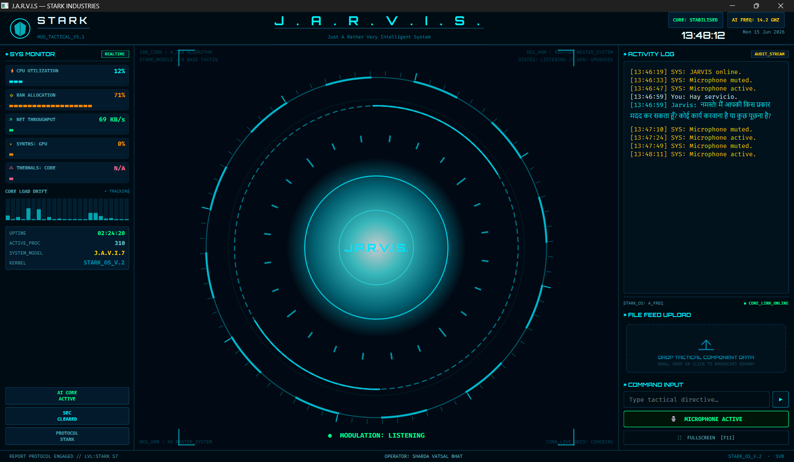

# 🛡️ STARK AI (J.A.R.V.I.S)

### The Ultimate Cross-Platform Personal AI Assistant
**Developed by Sharda Vatsal Bhat (SVB)**

STARK AI (J.A.R.V.I.S) is a voice-controlled AI personal assistant built on **Google Gemini Live API** with bidirectional audio streaming. It sees your screen, controls your computer, manages files, builds apps, writes code, sends messages, and much more — all through natural voice conversation.



---

## ✨ Features

### 🗣️ Voice Interface
- Real-time bidirectional audio streaming via Gemini Live API
- Automatic speech detection with push-to-talk mode
- Wake-word free — just start speaking after connection
- Voice activity-based muting (audio paused during tool execution)
- Configurable microphone and speaker devices

### 🤖 26+ Action Modules

| Category | Action | Description |
|----------|--------|-------------|
| **Vision** | `screen_process` | Captures screen or camera, analyzes with Gemini Vision, speaks a brief summary |
| **Code** | `code_helper` | Writes, edits, debugs code files with AI-powered analysis |
| **Code** | `dev_agent` | Full dev agent — plans, implements, and tests features autonomously |
| **Code** | `prompt_optimizer` | Optimizes and restructures prompts for better AI responses |
| **Research** | `notebooklm` | AI-powered research via Google NotebookLM — add sources, generate audio/video/reports, run deep research, and query notebooks via chat |
| **Web** | `web_search` | Searches the web and returns structured results with summaries |
| **Web** | `browser_control` | Controls Chrome browser — navigate, click, type, extract content |
| **File System** | `file_controller` | Creates, renames, moves, copies, deletes files and folders |
| **File System** | `file_processor` | Processes various file types (CSV, JSON, images, PDFs) with extraction |
| **File System** | `doc_creator` | Generates formatted documents (Markdown, PDF, HTML reports) |
| **Communication** | `send_message` | Sends WhatsApp, Telegram, and Email messages via configured APIs |
| **Communication** | `meeting_analyzer` | Analyzes meeting transcripts for action items, decisions, summaries |
| **System** | `computer_control` | Full PC control — keyboard typing, mouse clicks, hotkeys, clipboard |
| **System** | `computer_settings` | Adjusts system settings — volume, brightness, Wi-Fi, Bluetooth |
| **System** | `open_app` | Launches applications by name (Chrome, VSCode, Spotify, etc.) |
| **System** | `desktop` | Manages windows — minimize, maximize, close, switch, arrange |
| **System** | `ui_automation` | Interacts with ANY desktop app by visible label via Windows UIAutomation — click buttons, type into fields, read text, list controls |
| **Multimedia** | `image_generation` | Generates images via AI models (local or API-based generation) |
| **Multimedia** | `video_editing` | Edits videos — trim, concatenate, add effects, transitions |
| **Multimedia** | `content_studio` | Creates full content packs — thumbnails, captions, descriptions, scripts |
| **Multimedia** | `youtube_video` | Uploads videos to YouTube with title, description, tags, schedule |
| **Mobile** | `mobile_control` | Controls Android devices via ADB — tap, swipe, type, screenshot |
| **Build** | `frontend_builder` | Scaffolds and builds full frontend projects (React, Vue, HTML/CSS/JS) |
| **Build** | `apk_builder` | Builds Android APKs from source with gradle configuration |
| **Build** | `extension_builder` | Creates Chrome extensions from natural language descriptions |
| **Build** | `game_updater` | Updates game builds — patching, versioning, asset management |
| **Composio** | `composio_tools` | Integrates with 1000+ external apps via Composio (Slack, Notion, GitHub, etc.) |
| **Utilities** | `weather_report` | Gets current weather and forecasts for any location |
| **Utilities** | `flight_finder` | Searches flights between destinations with pricing |
| **Utilities** | `reminder` | Sets, lists, and manages reminders with desktop notifications |
| **Utilities** | `gesture_control` | Controls PC via hand gestures using webcam + MediaPipe |
| **Utilities** | `attention_monitor` | Monitors user attention — detects if you're away from the screen |

### 🧠 Semantic Memory (Mem0AI)

- **Persistent memory** — JARVIS remembers facts, preferences, and conversation history across sessions
- **Gemini embeddings** — Uses `gemini-embedding-2` for high-quality semantic search (3072-dim vectors)
- **ChromaDB storage** — Local, file-based vector database. No cloud, no server needed
- **Explicit facts** — Save structured memories with `save_memory` tool (categories like relationships, preferences, notes, tasks)
- **Auto-conversation** — Each conversation turn is automatically stored and retrievable
- **Context retrieval** — Relevant memories are loaded at startup and during conversations to personalize responses

### 🎨 User Interface (Holographic HUD)

- **PyQt6-powered HUD** — custom-drawn arc reactor core, animated rings, waveform bars, and tactical overlays
- **Orbitron & Fira Code** custom fonts for a futuristic aesthetic
- **System metrics** — real-time CPU, RAM, GPU, network, and thermal monitoring with neon bar widgets
- **Activity log** — typewriter-animated terminal-style output with color-coded entries
- **Sound effects** — startup chime, click sounds, error alerts (`sfx/` folder)
- **Mute toggle** — press `F4` to mute/unmute the microphone
- **Drag-and-drop** — file upload via drag-drop zone or file browser dialog

### 📚 NotebookLM Integration

JARVIS integrates with **Google NotebookLM** — Google's AI-powered research and content generation platform — via the unofficial `notebooklm-py` Python library.

- **Research** — Run fast or deep web research on any topic; results are grounded in sources
- **Source Management** — Add URLs, files (PDF/DOCX), pasted text, or Google Drive documents as sources
- **Content Generation** — Generate Audio Overviews (podcasts), videos, cinematic videos, reports, quizzes, flashcards, infographics, slide decks, data tables, and mind maps
- **Grounded Chat** — Ask questions about your sources with citations
- **Download** — Download generated artifacts (audio, video, quizzes, reports, etc.) to local files

> **Note:** Requires a Google account with access to [NotebookLM](https://notebooklm.google.com/). Authenticate once via `notebooklm login`.

### 🏗️ Agent Architecture

- **Planner** (`agent/planner.py`) — Decomposes complex requests into sub-tasks
- **Executor** (`agent/executor.py`) — Executes planned tasks with progress tracking
- **Task Queue** (`agent/task_queue.py`) — Manages concurrent task execution with dependencies
- **Error Handler** (`agent/error_handler.py`) — Graceful error recovery and retry logic

### ⚡ Real-time Audio Pipeline

- **WebSocket streaming** — Bidirectional audio via Gemini Live API
- **sounddevice** — Low-latency microphone capture and speaker playback
- **Tool-aware gate** — Audio queuing pauses during tool execution to prevent server conflicts
- **Auto-reconnect** — Seamless reconnection on connection drop
- **Playback queue** — Smooth audio playback with `sounddevice` callback streaming

---

## 🧱 Architecture

```
┌─────────────────────────────────────────────────────────────┐
│                     main.py (Orchestrator)                    │
│  ┌─────────────┐  ┌──────────────┐  ┌──────────────────┐   │
│  │ Gemini Live  │  │  Tool Router  │  │  Audio Pipeline  │   │
│  │ API Session  │  │ (25+ actions) │  │  (mic + speaker) │   │
│  └──────┬───────┘  └──────┬───────┘  └────────┬─────────┘   │
│         │                 │                    │              │
└─────────┼─────────────────┼────────────────────┼─────────────┘
          │                 │                    │
┌─────────▼─────────────────▼────────────────────▼─────────────┐
│                     actions/ (Modules)                        │
│  screen_processor.py    code_helper.py      web_search.py    │
│  file_controller.py     browser_control.py  computer_ctrl.py │
│  ... and 20+ more action modules                              │
└──────────────────────────────────────────────────────────────┘
          │
┌─────────▼──────────────────────────────────────────────────┐
│                  memory/mem0_memory.py                       │
│  ┌──────────────┐    ┌──────────────┐    ┌─────────────┐   │
│  │ Gemini Embed  │───▶│ ChromaDB     │───▶│ Memory      │   │
│  │ (embedding-2) │    │ (local .db)  │    │ Retrieval   │   │
│  └──────────────┘    └──────────────┘    └─────────────┘   │
└──────────────────────────────────────────────────────────────┘
          │
┌─────────▼──────────────────────────────────────────────────┐
│                    agent/ (Task Execution)                   │
│  planner.py    executor.py    task_queue.py    error_handler │
└──────────────────────────────────────────────────────────────┘
```

**Data flow:**
1. Audio stream → Gemini Live API → Text response → Audio playback
2. Gemini calls a tool → `_execute_tool()` routes to the right `actions/*.py` module
3. Tool result → returned to Gemini → spoken response + optional silent return
4. Conversations auto-saved to Mem0 memory for future context retrieval
5. Memories loaded at startup and injected into system prompt for personalization

---

## 🚀 Getting Started

### 1. System Prerequisites

| Requirement | Version |
|------------|---------|
| Python | 3.10+ |
| Operating System | Windows 10/11 (primary), Linux/macOS (experimental) |
| Google Gemini API Key | [Get one free](https://aistudio.google.com/apikey) |
| Microphone & Speaker | Required for voice interaction |
| Chrome | Required for `browser_control` and `browser-use` features |

### 2. Installation

```bash
# Clone the repository
git clone https://github.com/yourusername/stark-ai.git
cd stark-ai

# Install all Python dependencies
pip install -r requirements.txt

# Download Playwright browser engines (required for browser_control & content_studio)
playwright install

# Install NotebookLM Python API with browser auth support (optional but recommended)
# (uses your existing Playwright installation, does NOT reinstall it)
pip install "notebooklm-py[browser]" 

# Authenticate NotebookLM with your Google account (required once)
notebooklm login
```

> **Note:** `notebooklm login` opens a browser window to sign in with your Google account (the same one that has access to NotebookLM at notebooklm.google.com). After authentication, credentials are stored in `~/.notebooklm/`.

### 3. API Configuration

Create `config/api_keys.json` with your API keys:

```json
{
    "gemini_api_key": "YOUR_GEMINI_API_KEY_HERE",
    "opencode_zen_api_key": "YOUR_OPENCODE_ZEN_API_KEY_HERE (Optional)",
    "composio_api_key": "YOUR_COMPOSIO_API_KEY (Optional)",
     "os_system": "windows"
}
```

> **Note:** Only `gemini_api_key` is required for basic functionality. The rest are optional for specific features.

### 4. Run JARVIS

```bash
python main.py
```

**Controls:**
- `F4` — Toggle microphone mute
- `Ctrl+C` — Exit gracefully
- Just speak naturally after the `🔌 Connected` prompt

---

## 🔧 Configuration Reference

### `config/api_keys.json`

| Key | Required | Used By |
|-----|----------|---------|
| `gemini_api_key` | ✅ Yes | All features (Gemini models) |
| `opencode_api_key` | Optional | Deepseek V4 Flash (OpenCode Zen model) |
| `composio_api_key` | Optional | `composio_tools` — Composio SDK |

### `core/prompt.txt`

The system prompt that defines JARVIS's personality, behavior, and tool usage rules. You can customize:
- **Personality** — Tone, formality, role identity
- **Tool descriptions** — How each action module is called
- **Memory instructions** — When to save/retrieve memories
- **Response format** — How to structure spoken responses

### Audio Settings (in `main.py`)

| Variable | Default | Description |
|----------|---------|-------------|
| `INPUT_DEVICE_INDEX` | `None` | Specific mic device (list with `python -c "import sounddevice; print(sounddevice.query_devices())"`) |
| `OUTPUT_DEVICE_INDEX` | `None` | Specific speaker device |
| `SAMPLE_RATE` | `24000` | Audio sample rate (must match Gemini Live API) |
| `BLOCK_SIZE` | `48` | Audio buffer size for mic capture |
| `CHANNELS` | `1` | Mono audio input |

---

## 🛠️ Tool Reference

### Vision

#### `screen_process`
Captures and analyzes what's on screen or through the camera.
- **Parameters:** `angle` (`"screen"` or `"camera"`), `text` (user query)
- **Returns:** Brief spoken summary; full analysis logged to terminal
- **Dependencies:** `PIL`, `mss` (screenshot), `opencv-python` (camera)

### Code & Development

#### `code_helper`
Writes, edits, debugs, and explains code with AI analysis.
- **Parameters:** `prompt` (what to do with the code), `path` (file to work on)
- **Supports:** Any programming language, full file read/write, diff viewing

#### `dev_agent`
Full autonomous development agent — plans, implements, tests, and refactors.
- **Parameters:** `task` (development task description)
- **Workflow:** Analyze requirements → Plan → Implement → Test → Review

#### `prompt_optimizer`
Restructures and enhances prompts for better AI responses.
- **Parameters:** `prompt` (raw prompt), `target_model` (optional: gpt, claude, gemini)
- **Optimizations:** Clarity, structure, specificity, constraints

### Research & AI

#### `notebooklm`
Integrates with Google NotebookLM for AI-powered research, content generation, and grounded knowledge management.
- **Parameters:** `action` (notebooks: list/create/delete/get), (sources: add_url/add_file/add_text/list), (research: ask/add_web_research), (generate: audio/video/quiz/report/infographic/slide_deck/mind_map/data_table), (download)
- **Authentication:** Requires `notebooklm login` (one-time browser sign-in with Google account)
- **Features:** Fast & deep web research, add URLs/files/text as sources, generate audio overviews, videos, reports, quizzes, flashcards, infographics, mind maps, and more

### UI Automation (Windows)

#### `ui_automation`
Interacts with desktop applications by reading the actual Windows UI element tree (same API screen readers use).
- **Parameters:** `action` (click/list_controls/find_window/double_click/right_click/type_text/get_text/invoke/screenshot), `window`, `description` (element label), `ctrl_type`, `text`
- **Features:** Click buttons by visible label, type into text fields, read text from UI elements, discover all controls in a window, fallback to vision-based clicking if UIA fails
- **Windows only** — uses `comtypes` + `uiautomation` libraries

### Web & Browsing

#### `web_search`
Performs Google Custom Search and returns structured results.
- **Parameters:** `query` (search term)
- **Returns:** Top results with titles, snippets, URLs
- **Requires:** `google_cse_id` and `google_cse_key` in config

#### `browser_control`
Controls Chrome browser with Playwright — navigate, click, type, extract.
- **Parameters:** `action` (navigate/click/type/extract/screenshot), `url`, `selector`, `text`
- **Features:** Page navigation, element interaction, content extraction, screenshots

### File System

#### `file_controller`
Full file and directory management.
- **Parameters:** `action` (create/delete/rename/move/copy/list), `path`, `destination`, `content`
- **Safe operations:** All operations confined to the project directory

#### `file_processor`
Reads and processes various file formats.
- **Parameters:** `path` (file to process)
- **Supported formats:** CSV, JSON, XML, PDF, Images (OCR via pytesseract), DOCX

#### `doc_creator`
Generates formatted documents from structured content.
- **Parameters:** `format` (markdown/pdf/html), `title`, `content`, `output_path`
- **Features:** Templates, headers, lists, tables, code blocks

### Communication

#### `send_message`
Sends messages via multiple channels.
- **Parameters:** `channel` (whatsapp/telegram/email), `recipient`, `message`
- **WhatsApp:** Uses UIAutomation (opens WhatsApp Desktop)
- **Telegram:** Bot API (requires token + chat ID)
- **Email:** Gmail SMTP (requires app password)

#### `meeting_analyzer`
Analyzes meeting transcripts for key insights.
- **Parameters:** `text` (transcript content), `mode` (summary/action-items/decisions)
- **Returns:** Structured analysis with participants, decisions, action items, timeline

### System Control

#### `computer_control`
Full keyboard and mouse automation.
- **Parameters:** `action` (type/hotkey/mouse/scroll/clipboard), `text`, `key`, `x`, `y`
- **Features:** Key press sequences, hotkeys (Ctrl+C, Win+D), mouse movement, clipboard R/W

#### `computer_settings`
Adjusts system settings.
- **Parameters:** `setting` (volume/brightness/wifi/bluetooth), `value`
- **Volume:** 0–100 percentage
- **Brightness:** 0–100 percentage (Windows)

#### `open_app`
Launches applications by name.
- **Parameters:** `app_name` (chrome/vscode/spotify/calculator/explorer/terminal/notepad)
- **Platform:** Uses Windows `start` command; customizable app mapping

#### `desktop`
Window management.
- **Parameters:** `action` (minimize/maximize/close/switch/arrange/snap), `window_title`
- **Features:** Window snap (left/right/corner), virtual desktop switching (Win 10/11)

### Multimedia

#### `image_generation`
Generates images from text descriptions.
- **Parameters:** `prompt` (description), `model` (local/cloud), `size`, `count`
- **Supported engines:** Stable Diffusion (local), Gemini (API), DALL-E (API)

#### `video_editing`
Edits video files with FFmpeg.
- **Parameters:** `action` (trim/concat/effects/resize/convert), `input`, `output`, `params`
- **Features:** Trimming, concatenation, filters, transitions, format conversion

#### `content_studio`
Creates full content packs for social media.
- **Parameters:** `topic`, `platform` (youtube/tiktok/instagram/twitter), `style`
- **Output:** Thumbnail concepts, captions, hashtags, descriptions, scripts

#### `youtube_video`
Uploads videos to YouTube.
- **Parameters:** `video_path`, `title`, `description`, `tags`, `privacy` (public/unlisted/private)
- **Requires:** Google OAuth credentials for YouTube Data API v3

### Mobile

#### `mobile_control`
Controls Android devices via ADB (Android Debug Bridge).
- **Parameters:** `action` (tap/swipe/type/screenshot/app), `x`, `y`, `text`
- **Requires:** ADB installed and device connected via USB/Wi-Fi debugging

### Build Tools

#### `frontend_builder`
Scaffolds complete frontend projects.
- **Parameters:** `framework` (react/vue/vanilla), `name`, `description`
- **Output:** Full project with routing, components, styling, config files

#### `apk_builder`
Builds Android APK from source.
- **Parameters:** `source_path`, `build_type` (debug/release), `output_name`
- **Requires:** Android SDK + Gradle configured

#### `extension_builder`
Creates Chrome extensions from description.
- **Parameters:** `name`, `description`, `permissions`, `features`
- **Output:** Manifest V3 extension with popup, background script, content scripts

#### `game_updater`
Manages game build updates.
- **Parameters:** `action` (patch/version/assets), `game_path`, `version`
- **Features:** Asset patching, version bumping, build packaging

### Integrations

#### `composio_tools`
Accesses 1000+ third-party apps via Composio SDK.
- **Parameters:** `app` (slack/notion/github/jira/gmail/...), `action`, `params`
- **Requires:** `composio_api_key` in config
- **Examples:** Send Slack message, create GitHub issue, add Notion page

### Utilities

#### `weather_report`
Gets weather data for any location.
- **Parameters:** `location` (city name or coordinates), `units` (metric/imperial)
- **Returns:** Temperature, conditions, humidity, wind, forecast (5-day)
- **Requires:** `weather_api_key` from OpenWeatherMap

#### `flight_finder`
Searches for flights between destinations.
- **Parameters:** `origin`, `destination`, `date`, `passengers`
- **Returns:** Flight options with airlines, times, prices, duration

#### `reminder`
Sets and manages reminders.
- **Parameters:** `action` (set/list/delete/clear), `text`, `time` (in minutes from now)
- **Notifications:** Windows native toast notifications via `win10toast`

#### `gesture_control`
Controls the PC with hand gestures via webcam.
- **Parameters:** `action` (start/stop)
- **Gestures:** Swipe (left/right), pinch (zoom), fist (stop), point (cursor)
- **Requires:** `opencv-python`, `mediapipe`

#### `attention_monitor`
Detects user presence using webcam.
- **Parameters:** `action` (start/stop), `timeout_seconds` (away threshold)
- **Events:** User away / User returned / User drowsy
- **Requires:** `opencv-python`, `mediapipe`, `dlib`

---

## 🧠 Memory System (Mem0AI)

### How It Works

JARVIS uses **Mem0** to store and retrieve information with semantic understanding:

1. **Embeddings:** Every memory is converted to a vector using Gemini's `gemini-embedding-2` model
2. **Storage:** Vectors are stored locally in ChromaDB (a file-based vector database)
3. **Retrieval:** When JARVIS needs context, it searches for semantically similar memories
4. **History:** Past conversations are also vectorized and searchable

### Explicit Facts

Use the `save_memory` tool to store specific information:

| Category | Example |
|----------|---------|
| `relationships` | "My brother's name is Ayush Bhatt" |
| `preferences` | "I prefer dark mode in all apps" |
| `notes` | "Project deadline is next Friday" |
| `tasks` | "Remember to buy groceries tomorrow" |
| `custom` | Any structured key-value data |

### Auto-Memory

JARVIS automatically stores conversations in the background. When you restart the session, relevant past memories are loaded into context so JARVIS remembers who you are and what you've discussed.

### Storage Location

All memory data is stored locally in:
```
{project_root}/memory/vector_store/
```

No data is sent to any cloud service (except the Gemini embedding API call, which uses your API key).

---

## 🤖 Agent System

For complex, multi-step tasks, JARVIS uses an internal agent system:

### Planner (`agent/planner.py`)
- Decomposes high-level requests into executable sub-tasks
- Identifies dependencies between tasks
- Creates an ordered execution plan

### Executor (`agent/executor.py`)
- Runs tasks from the plan with progress tracking
- Handles task failures with retry logic
- Reports intermediate results

### Task Queue (`agent/task_queue.py`)
- Manages concurrent task execution
- Respects task dependencies (task B waits for task A)
- Load-balanced execution across available workers

### Error Handler (`agent/error_handler.py`)
- Catches and categorizes errors (retryable vs non-retryable)
- Implements exponential backoff for retries
- Logs structured error reports

---

## 📁 Project Structure

```
├── main.py                      # Entry point — orchestrates everything
├── ui.py                        # PyQt6 Holographic HUD interface
├── setup.py                     # Package setup
├── requirements.txt             # Python dependencies
├── readme.md                    # This file
│
├── actions/                     # All action modules (25+ files)
│   ├── screen_processor.py      # Vision: screen/camera analysis
│   ├── code_helper.py           # Code writing & debugging
│   ├── dev_agent.py             # Autonomous development agent
│   ├── web_search.py            # Google search
│   ├── browser_control.py       # Chrome automation
│   ├── file_controller.py       # File system operations
│   ├── file_processor.py        # File format processing
│   ├── doc_creator.py           # Document generation
│   ├── send_message.py          # WhatsApp/Telegram/Email
│   ├── meeting_analyzer.py      # Meeting transcript analysis
│   ├── computer_control.py      # Keyboard & mouse automation
│   ├── computer_settings.py     # System settings
│   ├── open_app.py              # Application launcher
│   ├── desktop.py               # Window management
│   ├── image_generation.py      # AI image generation
│   ├── video_editing.py         # Video editing
│   ├── content_studio.py        # Content creation suite
│   ├── youtube_video.py         # YouTube uploader
│   ├── mobile_control.py        # Android device control
│   ├── frontend_builder.py      # Frontend project scaffolder
│   ├── apk_builder.py           # APK build tool
│   ├── extension_builder.py     # Chrome extension creator
│   ├── game_updater.py          # Game update manager
│   ├── composio_tools.py        # Third-party app integrations
│   ├── weather_report.py        # Weather data
│   ├── flight_finder.py         # Flight search
│   ├── ui_automation.py         # Desktop automations
│   ├── reminder.py              # Reminder system
│   ├── gesture_control.py       # Hand gesture recognition
│   ├── attention_monitor.py     # User attention tracking
│   ├── prompt_optimizer.py      # Prompt optimization
│   └── notebooklm.py            # NotebookLM research & content generation
│
├── agent/                       # Internal task execution system
│   ├── planner.py               # Task decomposition
│   ├── executor.py              # Task execution engine
│   ├── task_queue.py            # Concurrent task management
│   └── error_handler.py         # Error recovery
│
├── memory/                      # Semantic memory system
│   ├── mem0_memory.py           # Mem0AI integration (Gemini embeddings + ChromaDB)
│   ├── __init__.py              # Memory module exports
│   ├── config_manager.py        # Memory configuration
│   └── memory_manager.py        # Legacy memory manager (JSON-based, deprecated)
│
├── config/                      # Configuration
│   ├── api_keys.example.json    # API key template
│   ├── api_keys.json            # Your actual API keys (gitignored)
│   ├── genai_client.py          # Gemini client configuration
│   └── __init__.py              # Config exports
│
├── core/                        # Core system files
│   └── prompt.txt               # System prompt (JARVIS's personality & rules)
│
├── fonts/                       # Custom TUI fonts
│   ├── Orbitron-*.ttf           # Futuristic display font
│   └── FiraCode-*.ttf           # Monospace coding font
│
├── sfx/                         # Sound effects
│   ├── startup.wav              # Startup chime
│   ├── click.wav                # UI click feedback
│   └── error.wav                # Error alert
│
└── .github/                     # CI/CD workflows
    ├── workflows/
    │   ├── gemini-invoke.yml
    │   ├── gemini-review.yml
    │   └── ...
    └── commands/
        ├── gemini-invoke.toml
        └── ...
```

---

## 📋 Notes

- **Human-in-the-Loop (HITL):** A mandatory 🛡️ **STARK SECURITY PROTOCOL** confirmation popup guards destructive actions (deleting files, system shutdown, etc.). This security layer cannot be bypassed — you'll always be asked to confirm before anything irreversible happens.
- **System Control:** Some modules (`computer_control`, `desktop`, `browser_control`, `mobile_control`) can perform powerful actions on your system. It's a good idea to test them in a safe environment first to get comfortable with what they can do.
- **API Keys:** Your API keys are stored in `config/api_keys.json`. Keep this file safe and don't share it publicly — just like you would with any password.
- **Internet Usage:** Modules like `web_search`, `send_message`, `composio_tools`, and `youtube_video` send data to third-party services. Check their terms of service if you're using them extensively.
- **AI Accuracy:** AI-generated code, file edits, and analysis may contain errors or unexpected behaviour. Review changes before applying them to anything important.
- **Voice Privacy:** Voice audio is streamed to Google's Gemini API for processing. No audio is permanently stored by this project locally beyond what's needed for real-time interaction.

---

## 📝 License

This project is for personal and educational use. All dependencies and APIs are subject to their respective licenses and terms of service.

---

## 🙏 Acknowledgements

- **Google Gemini** — Live API for real-time voice AI
- **Mem0** — Open-source memory layer for LLMs
- **ChromaDB** — Local vector database
- **Playwright** — Reliable browser automation
- **Composio** — Third-party app integrations
- **notebooklm-py** — Unofficial NotebookLM Python API

---

## 🌟 Support
Built by **Sharda Vatsal Bhat (SVB)**.
⭐ **Star this repository** if you find it useful.
